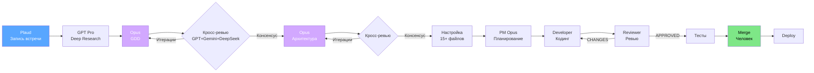
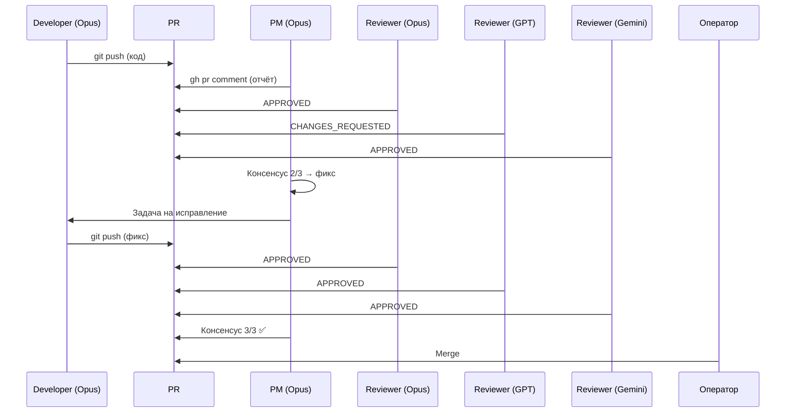
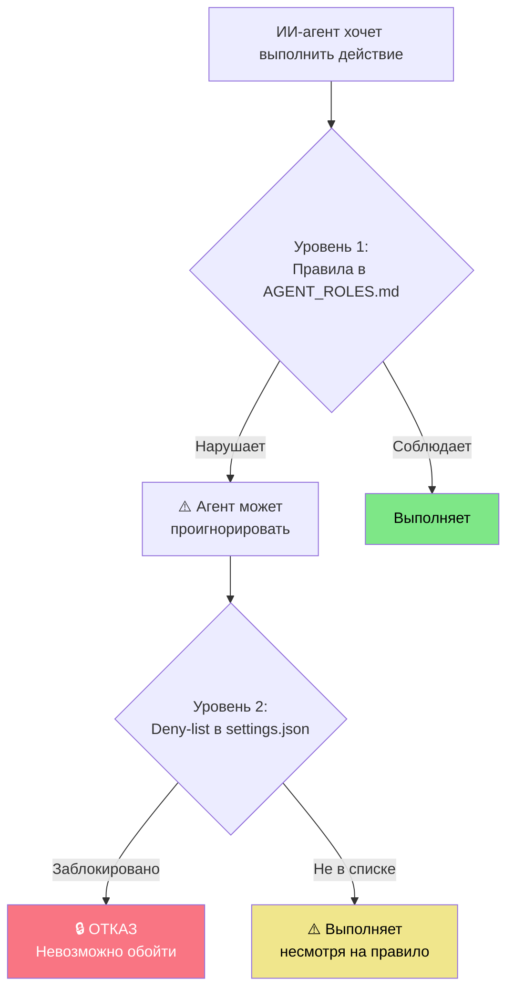

# ТЗ на презентацию: Рабочее место ИИ-агентного инженера

## Общие параметры

- **Формат:** 16:9, ~30 слайдов
- **Стиль:** тёмная тема (dark mode), минимализм
- **Шрифты:** заголовки — крупный sans-serif (Inter, SF Pro, Manrope), код — JetBrains Mono
- **Цветовая палитра:**
  - Фон: `#0D1117` (GitHub dark) или `#1A1A2E`
  - Акцент 1: `#58A6FF` (голубой, Claude)
  - Акцент 2: `#7EE787` (зелёный, успех)
  - Акцент 3: `#F97583` (красный, проблемы/danger)
  - Акцент 4: `#D2A8FF` (фиолетовый, GPT)
  - Текст: `#E6EDF3`
- **Персонаж:** стилизованный аватар докладчика (3D cartoon style, как Notion-аватары или Lottie-персонажи). Появляется на титульном, финальном и 2-3 ключевых слайдах.
- **Инструменты для создания:** Figma / Keynote / Google Slides / PowerPoint. Диаграммы — Mermaid → SVG. Скриншоты кода — Carbon.now.sh (тема: Dracula).

---

## Слайд 1: Титульный

**Контент:**
- Крупный заголовок: «Рабочее место ИИ-агентного инженера»
- Подзаголовок: «Результаты зимнего исследования»
- Имя докладчика, должность, дата
- Логотип компании

**Визуал:**
- Персонаж-аватар справа (3D стиль, за ноутбуком, вокруг — иконки ИИ-моделей)
- Фон: тёмный с лёгким градиентом и subtle grid-паттерном
- Иконки моделей: Claude, GPT, Gemini, Copilot — расположены вокруг персонажа как "орбита"

**Заметки спикера:** Приветствие, краткое описание эксперимента.

---

## Слайд 2: Vibe Coding vs Agentic Engineering

**Контент:**

Две колонки:

| | Vibe Coding | Agentic Engineering |
|---|---|---|
| Кто ведёт | Человек пишет промпты | ИИ-агенты по ролям |
| Контроль | На глаз | Тесты + ревью |
| Воспроизводимость | 0% | 100% |
| Масштаб | Прототипы | Production |

**Визуал:**
- Левая колонка (Vibe): хаотичная иллюстрация — много стрелок, вопросительные знаки, красный/оранжевый оттенок
- Правая колонка (Agentic): структурированная схема — чёткие блоки, стрелки, зелёный/голубой оттенок
- Между колонками: разделитель "≠" крупным шрифтом

**Заметки спикера:** Объяснение разницы, примеры.

---

## Слайд 3: Три проекта

**Контент:**

Горизонтальная timeline:

```
Декабрь 2025     Январь 2026        Февраль–Март 2026
    ●─────────────────●──────────────────────●
   U2              Slime Arena           Bonk Race
 эксперимент      83K строк TS         форк + эволюция
                  31 день               пайплайна
                  Soft Launch ready     v0.6.0
```

**Визуал:**
- Timeline с тремя точками, каждая — своего цвета
- Под каждой точкой — иконка проекта и ключевые метрики
- Стрелки "улучшения процесса" между проектами (пунктир)
- Подпись снизу: «Каждый проект улучшал сам рабочий процесс»

**Заметки спикера:** Краткая история трёх проектов.

---

## Слайд 4: Стек нейросетей — таблица

**Контент:**

| Модель | Роль | Оценка |
|--------|------|--------|
| Claude Opus 4.6 | PM, Dev, Reviewer | Основной |
| GPT-5.4 | Ревьювер, research | Лучший ревьювер |
| GPT-5.3-Codex | Ревьювер, кодинг | Быстрый, дешёвый |
| GPT Pro | Deep research | Глубокий анализ |
| Gemini | Cross-check | ⚠️ Неуправляем |
| Copilot | Автодополнение | IDE-интеграция |
| DeepSeek | Cross-check | Бесплатный |
| MidJourney | Арт, ассеты | Визуал |
| Plaud | Запись встреч | Hardware AI |

**Визуал:**
- Таблица с логотипами моделей слева от каждой строки
- Цветовая кодировка оценки: зелёный (хорошо), жёлтый (с нюансами), красный (проблемы)
- Gemini — строка с жёлтым/оранжевым предупреждением

**Заметки спикера:** Подробности по каждой модели.

---

## Слайд 5: Принцип выбора модели

**Контент:**

Три блока:

```
🧠 Планирование/Архитектура    ⚡ Рутина/Кодинг           🔍 Ревью
   Дорогие модели                Быстрые модели             Несколько параллельно
   Opus, GPT Pro                 Codex, Copilot             Opus + GPT + DeepSeek
   Ошибка стоит дорого          Скорость важнее             Кросс-валидация
```

**Визуал:**
- Три карточки горизонтально
- Иконки: мозг, молния, лупа
- Стрелка снизу: «Стоимость ↔ Качество — баланс для каждого этапа»

---

## Слайд 6: Процесс — общая схема

**Контент:**

Горизонтальный pipeline из 3 фаз:

```
Фаза A: Исследование        Фаза B: Настройка         Фаза C: Разработка
┌─────────────────────┐    ┌───────────────────┐    ┌──────────────────────────┐
│ Plaud → GPT Pro →   │    │ GitHub repo       │    │ PM → Developer →         │
│ Opus GDD →          │───►│ Настройка 15+     │───►│ Reviewer (внутр.) →      │
│ Кросс-ревью GDD →   │    │ файлов конфигов   │    │ Reviewer (внешн.) →      │
│ Opus Архитектура →   │    │ Memory Bank       │    │ Тесты → Merge → Deploy  │
│ Кросс-ревью Арх.    │    │ Beads             │    │                          │
└─────────────────────┘    └───────────────────┘    └──────────────────────────┘
```

**Визуал:**
- Три блока с иконками
- Стрелки между блоками
- Цветовая кодировка фаз
- Подпись: «19 шагов от идеи до деплоя»

---

## Слайд 7: Фаза A — детали

**Контент:**

Вертикальный список:
1. Plaud → запись встречи → транскрипт + summary
2. GPT Pro (Thinking) → анализ рынка → отчёт
3. Opus → GDD v1 (модульная структура)
4. GPT + Gemini + DeepSeek → кросс-ревью GDD (2-4 итерации)
5. Opus → Архитектура v1
6. GPT + Gemini + DeepSeek → кросс-ревью (до консенсуса)

**Визуал:**
- Вертикальный flow с иконками моделей
- Стрелки-петли для итераций (шаги 3-4 и 5-6)
- Рядом с каждым шагом — логотип модели

---

## Слайд 8: PR как шина коммуникации — заголовок

**Контент:**
- Крупный заголовок: «Pull Request = шина обмена информацией»
- Подзаголовок: «Как разные ИИ-модели общаются между собой»

**Визуал:**
- Иконка PR (GitHub pull request icon) в центре, крупная
- Вокруг — логотипы моделей, соединённые линиями с PR
- Фон: тёмный с subtle connection lines

---

## Слайд 9: PR как шина — схема потока

**Контент:**

```
Developer (Opus)        ──push──►  PR #42
                                     │
PM (Opus)        ── gh pr comment ──►│ "Developer Report: ..."
                                     │
Reviewer 1 (Opus) ── gh pr comment ─►│ "APPROVED"
Reviewer 2 (GPT)  ── gh pr comment ─►│ "CHANGES_REQUESTED"
Reviewer 3 (Gemini)── gh pr comment ►│ "APPROVED"
                                     │
PM (Opus)         ── парсит JSON  ──►│  консенсус 2/3
                                     │
Developer (Opus)        ──push──►  фикс
                                     │
Reviewers          ── ре-ревью ──►   консенсус 3/3 ✅
                                     │
Оператор (человек) ────merge────►  main
```

**Визуал:**
- Вертикальная flow-диаграмма
- Каждый участник — иконка с логотипом модели
- PR — центральный столб (как timeline)
- Комментарии — горизонтальные стрелки к столбу
- Зелёная галочка на merge

---

## Слайд 10: Почему PR, а не чат

**Контент:**

4 причины:
1. **Аудиторский след** — кто, когда, какой вердикт
2. **Мультимодельность** — GPT, Gemini, Opus пишут в одно место
3. **Автоматизация** — PM парсит JSON-метаданные из комментариев
4. **Прозрачность** — оператор видит всю историю решений

**Визуал:**
- 4 карточки с иконками
- Каждая карточка — одна причина с короткой иллюстрацией

---

## Слайд 11: Файлы настроек — заголовок

**Контент:**
- Крупный заголовок: «15+ файлов конфигурации»
- Подзаголовок: «Что настроить перед первой строкой кода»

**Визуал:**
- Дерево файлов (как в IDE) на тёмном фоне
- Подсветка ключевых файлов

---

## Слайд 12: Какая модель какой файл читает

**Контент:**

Таблица-матрица:

```
                   Claude Code   Copilot   Cursor   GPT/Gemini
CLAUDE.md          ✅ авто       ❌        ⚙️ rule   ❌
.claude/settings   ✅ авто       ❌        ❌        ❌
copilot-instr.md   ❌            ✅ авто   ❌        ❌
.cursorignore      ❌            ❌        ✅ авто   ❌
AGENT_ROLES.md     ✅ ссылка     ✅ ссылка  ✅ ссылка  📋 вручную
.memory_bank/*     ✅ ссылка     ❌        ✅ индекс  📋 вручную
```

**Визуал:**
- Таблица с цветовыми маркерами (зелёный = авто, жёлтый = ссылка, серый = нет, синий = вручную)
- Логотипы инструментов в заголовках столбцов
- Выделена строка AGENT_ROLES.md — "точка конвергенции"
- Стрелка-подпись: «AGENT_ROLES.md — единый документ для всех»

---

## Слайд 13: settings.json — deny-list

**Контент:**

Скриншот кода (Carbon.now.sh, тема Dracula):

```json
"deny": [
  "Read(.env*)",              // 🔒 Секреты
  "Read(**/secrets*)",        // 🔒 Секреты
  "Bash(rm -rf:*)",           // 🔒 Удаление (Linux)
  "Bash(rm *)",               // 🔒 Удаление файлов
  "Bash(del *)",              // 🔒 Удаление (Windows)
  "Bash(git push --force *)", // 🔒 Force push
  "Bash(git push origin main)", // 🔒 Push в main
  "Bash(gh pr merge *)",      // 🔒 Авто-merge
  "Bash(gh repo delete *)",   // 🔒 Удаление репо
  "Bash(gh api -X DELETE *)"  // 🔒 DELETE через API
]
```

Подпись: **«Два уровня защиты: правила можно обойти, deny-list — нельзя»**

**Визуал:**
- Скриншот кода с подсветкой
- Справа — два блока:
  - "Уровень 1: Правила (AGENT_ROLES.md)" — с предупреждением "⚠️ Агент может забыть"
  - "Уровень 2: Deny-list (settings.json)" — с замком "🔒 Хардкод, нельзя обойти"

---

## Слайд 14: settings.json — остальные настройки

**Контент:**

```json
{
  "language": "russian",              // Ответы на русском
  "alwaysThinkingEnabled": true,      // Глубокий анализ
  "enableAllProjectMcpServers": true, // Beads MCP
  "plansDirectory": "./docs/plans",   // Планы спринтов
  "defaultMode": "acceptEdits"        // Авто-принятие правок
}
```

**Визуал:**
- Скриншот кода + аннотации-стрелки к каждому полю
- Иконки рядом с каждым объяснением

---

## Слайд 15: Memory Bank

**Контент:**

Схема из 6 файлов:

```
.memory_bank/
├── projectbrief.md      📌 Зачем проект       (редко)
├── productContext.md     🎯 Продуктовый контекст (редко)
├── techContext.md        🔧 Стек и ограничения   (при смене)
├── systemPatterns.md     🏗️ Архитектурные решения (при арх.)
├── activeContext.md      🔴 ЧТО СЕЙЧАС           (каждую сессию!)
└── progress.md           📊 Прогресс и статус    (каждый спринт)
```

Подпись: **«Без Memory Bank каждая сессия начинается с нуля»**

**Визуал:**
- Иконка папки с файлами
- activeContext.md выделен красным/оранжевым — "живой файл"
- Стрелка: "Агент читает первым → сразу в контексте"

---

## Слайд 16: Beads — задачи как код

**Контент:**

```bash
bd ready                           # Доступные задачи
bd update <id> --status=in_progress  # Взять в работу
bd close <id> --reason="PR #42"     # Закрыть
```

Подпись: «CLI-first: агенты работают с задачами программно»

**Визуал:**
- Скриншот терминала с Beads-командами
- Сравнение: слева — Jira board (скриншот), справа — Beads CLI
- Подпись: «Агенту не нужен браузер»

---

## Слайд 17: God Objects — правило-защитник стало причиной

**Контент:**

```
ArenaRoom.ts    3700+ строк    126 методов
main.ts         4000+ строк    UI + сеть + рендер + ввод
```

**Ирония:** правило "минимальное изменение" из CLAUDE-core.md привело к God Objects — агенты добавляют код в существующий файл вместо создания нового модуля.

**Визуал:**
- Визуализация размера файла (большой блок vs множество маленьких)
- Стрелка от правила "минимальное изменение" к God Object
- Подпись: «Правило-защитник стало причиной проблемы»

---

## Слайд 18: Агенты не следуют инструкциям

**Контент:**

Две проблемы с одной причиной — **агент «забывает» правила:**

| Проблема | Пример | Compliance |
|----------|--------|------------|
| Цикл ревью обрывается | PR #5: coin farm (P0) не исправлен за 3 итерации | ~30% циклов завершаются полностью |
| Язык комментариев | Правило в 3 файлах, но агенты пишут на английском | ~70% |

**Причина:** субагент запускается в чистом контексте, модели обучены на англоязычном коде

**Визуал:**
- Два блока рядом: схема обрыва цикла (Код→Ревью→Фикс→❌) + скриншот английского комментария
- Подпись: «Правила — первый уровень защиты. Deny-list — второй.»

---

## Слайд 19: Слабые места — безопасность, инфра, Gemini

**Контент:**

| Область | Проблема | Вывод |
|---------|---------|-------|
| **Безопасность** | 3 уязвимости (P0–P1), не исправлены за 3 итерации | Кросс-ревью обязательно |
| **Инфраструктура** | Docker: 3 withdrawn-версии. Redis: 22ч даунтайма | DevOps ≠ задача для агентов |
| **Gemini** | Игнорирует «НЕ правь код», ложно-положительные APPROVED | Не доверять вердиктам |

**Визуал:**
- Три строки с иконками: замок (безопасность), сервер (инфра), warning (Gemini)
- Каждая строка — проблема → вывод
- Компактно, без деталей (детали в документе для чтения)

---

## Слайд 20: Сводка проблем

**Контент:**

| Проблема | Статус | Workaround |
|---------|--------|------------|
| God Objects | ⚠️ Рефакторинг | Осторожные изменения |
| Цикл ревью обрывается | ❌ | Ручной запуск итераций |
| Английский в комментариях | ⚠️ 70% | Отдельный PR |
| Безопасность | ⚠️ | 3+ ревьювера разных моделей |
| Инфраструктура | ❌ | Человеческий контроль |
| Gemini | ❌ | Не доверять вердиктам |

**Визуал:**
- Компактная таблица с цветовыми статусами
- Подпись: «Мы знаем проблемы. Стартер-кит учитывает их.»

---

## Слайд 21: Три столпа пайплайна

**Контент:**

```
┌─────────────────────────────────────────────────────────┐
│                                                         │
│   Столп 0              Столп 1            Столп 2       │
│   ┌──────────┐        ┌──────────┐       ┌──────────┐  │
│   │ Подробные│        │  Memory  │       │  Beads   │  │
│   │    ТЗ    │        │   Bank   │       │          │  │
│   │          │        │          │       │          │  │
│   │ GDD      │        │ .memory_ │       │ .beads/  │  │
│   │ Архитект.│        │  bank/   │       │ bd ready │  │
│   │ RFC      │        │ 6 файлов │       │ bd close │  │
│   └──────────┘        └──────────┘       └──────────┘  │
│   Что строить         Что было            Что делать    │
│   (контракт)          (память)            (задачи)      │
│                                                         │
│   ══════════════════════════════════════════════════════ │
│           Убери любой → система разваливается           │
└─────────────────────────────────────────────────────────┘
```

Подпись: **«Стартер-кит — это настройки инструмента. Три столпа — это процесс.»**

**Визуал:**
- Три колонны (как в древнегреческом храме) на тёмном фоне
- Каждая колонна — свой цвет (голубой, зелёный, фиолетовый)
- Под колоннами — фундамент с надписью «Убери любой → система разваливается»
- Над колоннами — крыша «Agentic Engineering»
- Ссылки на Хабр: Memory Bank (habr/979624), Beads (habr/983498)

---

## Слайд 22: 8 уровней агентной инженерии

**Контент:**

> На основе статьи [«8 уровней агентной инженерии»](https://habr.com/p/1010430/)

```
Уровень 8 │ ★ Автономные команды агентов
Уровень 7 │ ★ Фоновые агенты
Уровень 6 │ ★ Обвязка и обратная связь        ◄── 🟡 частично
Уровень 5 │ ★ Инструменты и навыки (MCP)      ◄── 🟡 частично
Уровень 4 │ ★ Накопление опыта                ◄── ✅ мы здесь
Уровень 3 │ ★ Управление контекстом           ◄── ✅ освоен
Уровень 2 │ ★ ИИ-среда разработки
Уровень 1 │ ★ Автодополнение
```

Три вопроса:
1. На каком уровне вы сейчас? (Большинство — 2–3)
2. Что мешает перейти на следующий?
3. Готовы инвестировать в уровни 3–5, чтобы разблокировать 6–7?

**Визуал:**
- Вертикальная шкала-лестница (снизу вверх)
- Уровни 3–4 подсвечены зелёным (✅), 5–6 жёлтым (🟡), 7–8 серым (будущее)
- Стрелка «мы здесь» указывает на уровень 4
- Подпись: «Фундамент (3–5) → разблокирует автоматизацию (6–7)»

---

## Слайд 23: Эмоциональная кривая ИИ-разработки

**Контент:**

> По мотивам статьи [«Цветы для Элджернона и Claude Code»](https://vc.ru/ai/2800102) (Nolan & Claude)

```
Амплитуда
  │
  │   ╱╲        Фаза 1: Эйфория
  │  ╱  ╲       ноябрь · U2
  │ ╱    ╲      «за часы — то, что раньше за месяцы»
  │╱      ╲
  │        ╲     Фаза 2: Затухание
  │         ╲╱╲  декабрь–январь · Slime Arena
  │            ╲ «вау требует всё больших запусков»
  │             ╲___________  Фаза 3: Плато
  │                           февраль–март · Bonk Race
  │                           «принятие или онемение?»
  └──────────────────────────► Время
```

Подпись: **«Эйфория → God Objects. Затухание → нужна система. Плато → устойчивая работа»**

**Визуал:**
- График затухающей синусоиды (амплитуда → плато)
- Три зоны с цветовой кодировкой: красная (эйфория), жёлтая (затухание), голубая (плато)
- Под графиком — timeline трёх проектов (та же, что на слайде 3)
- Overlay двух шкал: техническая (8 уровней) слева, эмоциональная справа

---

## Слайд 24: Стартер-кит — что получаете

**Контент:**

Дерево файлов:

```
starter-kit/
├── CLAUDE.md.template
├── CLAUDE-core.md.template
├── .agents/
│   ├── AGENT_ROLES.md.template
│   └── HOW_TO_USE.md
├── .claude/
│   └── settings.json
├── .github/
│   └── copilot-instructions.md.template
├── .memory_bank/
│   ├── projectbrief.md.template
│   ├── activeContext.md.template
│   └── ... (5 шаблонов)
├── .vscode/settings.json
└── .cursorignore
```

**Визуал:**
- Стилизованное дерево файлов на тёмном фоне
- Иконки типов файлов
- Подпись: «Скопировать → заменить плейсхолдеры → работать»

---

## Слайд 25: Три уровня погружения

**Контент:**

```
Уровень 1: Минимальный        Уровень 2: Базовый          Уровень 3: Полный
┌─────────────────────┐     ┌─────────────────────┐     ┌─────────────────────┐
│ CLAUDE.md            │     │ + copilot-instr.md  │     │ + .agents/          │
│ settings.json        │     │ + .cursorignore     │     │ + .memory_bank/     │
│                      │     │ + .vscode/settings  │     │ + Beads             │
│ 🕐 10 минут          │     │ 🕐 20 минут          │     │ 🕐 1 час             │
│ 1 агент              │     │ Мультиинструмент    │     │ Мультиагент         │
└─────────────────────┘     └─────────────────────┘     └─────────────────────┘
```

**Визуал:**
- Три карточки горизонтально, с нарастающим размером
- Цветовой градиент от простого к сложному
- Каждая карточка — с иконкой уровня (1, 2, 3)

---

## Слайд 26: Быстрый старт

**Контент:**

```bash
# 1. Скопировать шаблоны в корень проекта
cp -rn docs/starter-kit/. ./   # -n: не перезаписывать

# 2. Переименовать шаблоны (.template → готовый файл)
find . -name "*.template" -exec sh -c \
  'mv "$1" "${1%.template}"' _ {} \;

# 3. Заменить плейсхолдеры
# [PROJECT_NAME], [BUILD_CMD], [TEST_CMD]

# 4. Заполнить Memory Bank + запустить
claude
```

Подпись: **«5 минут до первой сессии»**

**Визуал:**
- Скриншот терминала (Carbon.now.sh)
- Крупная подпись "5 минут"
- Стрелка от кода к результату (скриншот Claude Code в работе)

---

## Слайд 27: Финальный

**Контент:**
- Крупный текст: «Agentic Engineering — это настоящее»
- Подтекст: «Со всеми проблемами, которые я описал. Но оно работает.»
- «Стартер-кит в репозитории. Пробуйте.»

**Визуал:**
- Персонаж-аватар (крупно, уверенная поза)
- QR-код на репозиторий со стартер-китом
- Контактная информация

---

## Слайд 28: Q&A

**Контент:**
- «Вопросы?»
- Список тем для обсуждения:
  - Стоимость
  - Конфиденциальность
  - Командная работа
  - Ограничения

**Визуал:**
- Минималистичный слайд
- Персонаж с вопросительным знаком
- Контактная информация

---

## Слайд 29 (бонус): Заготовленные ответы на Q&A

**Контент (не показывается, только в заметках спикера):**

| Вопрос | Ответ |
|--------|-------|
| Сколько стоит? | $120–240/мес (Claude $100–200 + GPT $20–40). Джуниор — от $2000/мес. |
| Конфиденциальность? | Код идёт в API. Проверьте compliance. Self-hosted — опция. |
| Команда? | CLAUDE.md коммитится в репо. Memory Bank общий. Сессии пока однопользовательские. |
| Когда НЕ подходит? | Banking, medical (нужен human review). DevOps. Легаси без тестов. |

---

## Генерация персонажа (MidJourney)

### Промпт для MidJourney

```
3D cartoon character, male software engineer, sitting at a modern desk
with multiple monitors showing code and AI chat interfaces, wearing
casual tech company clothes (hoodie or t-shirt), friendly confident
expression, surrounded by floating icons of AI logos (brain, robot,
code brackets), dark moody background with subtle blue and purple
lighting, Pixar-style rendering, clean minimal aesthetic --ar 16:9
--style raw --v 6.1
```

### Варианты использования персонажа

1. **Титульный слайд** — полная фигура за рабочим столом
2. **Слайд проблем** — задумчивое выражение, рука у подбородка
3. **Финальный слайд** — уверенная поза, жест приглашения
4. **Q&A** — с вопросительным знаком

### Альтернативный промпт (более стилизованный)

```
Minimalist 3D avatar, tech professional, sitting in dark-themed IDE
environment, holographic AI agents floating around as glowing orbs
(blue, purple, green), each orb has a tiny label (PM, Dev, Reviewer),
isometric view, glass-morphism UI elements, dark background #0D1117,
accent colors #58A6FF #7EE787 #D2A8FF, clean vector-like rendering
--ar 16:9 --style raw --v 6.1
```

---

## Диаграммы для генерации (Mermaid)

### Диаграмма 1: Процесс от идеи до деплоя (Слайд 6)



### Диаграмма 2: PR как шина (Слайд 9)



### Диаграмма 3: Два уровня защиты (Слайд 13)



---

## Скриншоты для подготовки

| Слайд | Что сделать | Инструмент |
|-------|-------------|------------|
| 13 | Скриншот settings.json с deny-list | Carbon.now.sh (Dracula) |
| 14 | Скриншот settings.json с остальными настройками | Carbon.now.sh (Dracula) |
| 15 | Скриншот дерева .memory_bank/ в VS Code | VS Code screenshot |
| 16 | Скриншот терминала с Beads | Terminal screenshot |
| 19 | Скриншот кода с английским комментарием | VS Code screenshot |
| 25 | Скриншот дерева starter-kit/ в VS Code | VS Code screenshot |
| 27 | Скриншот терминала с quick-start командами | Carbon.now.sh |

---

## Чеклист подготовки презентации

- [ ] Сгенерировать персонажа в MidJourney (4 варианта)
- [ ] Отрендерить Mermaid-диаграммы в SVG (3 штуки)
- [ ] Сделать скриншоты кода через Carbon.now.sh (4 штуки)
- [ ] Сделать скриншоты VS Code (3 штуки)
- [ ] Собрать логотипы моделей (Claude, GPT, Gemini, Copilot, DeepSeek, MidJourney, Plaud)
- [ ] Создать слайды в Figma/Keynote/Google Slides
- [ ] Проверить хронометраж (30 мин)
- [ ] Прогнать доклад вслух 1-2 раза
- [ ] Подготовить QR-код на репозиторий
